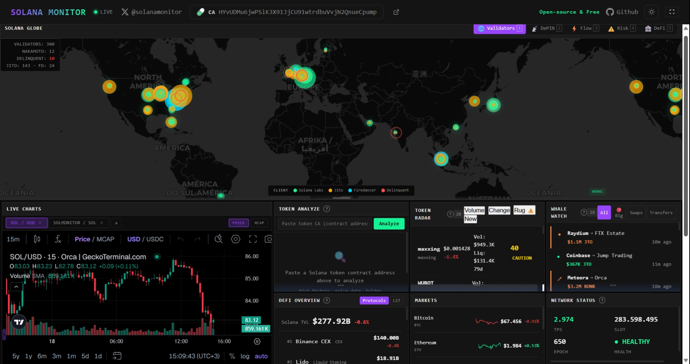

# Solana Monitor

### 🌐 [solanamonitor.app](https://solanamonitor.app)

**Real-time Solana blockchain intelligence dashboard** — live on-chain data, DeFi analytics, whale tracking, ETF flows, and AI-powered market signals on an interactive deck.gl 3D globe.

[](https://opensource.org/licenses/MIT)
[](https://www.typescriptlang.org/)
[](https://solana.com)

<p align="center">
  <a href="https://solanamonitor.app"></a>
</p>

<p align="center">
  <a href="https://x.com/solanamonitor">𝕏 @solanamonitor</a> · CA: <code>ERPGD6N8n8m3G1UN1H3fDCHF65g73EoKYWqETD4MBAGS</code>
</p>

<p align="center">
  <a href="https://bags.fm/ERPGD6N8n8m3G1UN1H3fDCHF65g73EoKYWqETD4MBAGS">
     View on Bags.fm
  </a>
</p>

<p align="center">
  <a href="https://solanamonitor.app">
    
  </a>
</p>

---

## What is Solana Monitor?

A free, open-source dashboard for monitoring the Solana ecosystem in real time. Track on-chain activity, DeFi protocols, validator performance, whale movements, Solana ETF flows, and AI-generated insights — all rendered on an interactive WebGL globe.

---

## Panels

| # | Panel | Description |
|---|-------|-------------|
| 1 | **Solana Globe** | Interactive 3D globe — validators, stake heatmap, DePIN (Helium IoT/Mobile), data center clusters |
| 2 | **Live Charts** | Real-time SOL price charts with TradingView integration |
| 3 | **Token Analyze** | Deep token analysis — holders, liquidity, risk score, contract audit |
| 4 | **Token Radar** | New token launches, trending tokens, and DexScreener data |
| 5 | **DeFi Overview** | TVL, volume, and top 50 Solana protocols via DeFiLlama |
| 6 | **Network Status** | TPS, slot height, validator count, epoch progress, stake distribution |
| 7 | **Liquid Staking** | mSOL, jitoSOL, bSOL staking rates and TVL |
| 8 | **MEV & Jito** | MEV activity, Jito tips, bundle analytics, and validator performance |
| 9 | **AI Insights** | AI-generated market briefs and trend detection (Groq / OpenRouter) |
| 10 | **Solana News** | Aggregated RSS feeds from Solana ecosystem sources |
| 11 | **Solana ETF Tracker** | Real-time Solana ETF data — SOLZ, GSOL, VSOL, BSOL, FSOL, SOLT, SOLX (Yahoo Finance) |
| 12 | **NFT Tracker** | Solana NFT collection floor prices and volume |
| 13 | **Governance** | Solana governance proposals and voting activity |

## Globe Layers

| Layer | Source |
|-------|--------|
| Validators & Stake | Helius RPC + validators.app |
| Stake Heatmap | On-chain vote accounts |
| Data Center Clusters | IP geolocation of validator nodes |
| DePIN Helium | 48K+ IoT & 28K+ Mobile hotspots |
| Whale Flow Arcs | Helius transaction history |

---

## Tech Stack

- **Frontend:** TypeScript, Vite 6, vanilla DOM (no React)
- **3D Globe:** deck.gl 9 + MapLibre GL with 10+ WebGL layers
- **Backend:** 10 Vercel Edge Functions (serverless)
- **AI:** Groq (primary) / OpenRouter (fallback) for market summaries
- **Data Sources:** Helius, Yahoo Finance, DeFiLlama, CoinGecko, Validators.app, Helium, SocialData, DexScreener
- **Caching:** Upstash Redis (cross-visitor deduplication)
- **PWA:** Installable with offline support

---

## Serverless Functions

| Endpoint | Purpose |
|----------|---------|
| `/api/coingecko` | SOL price, market data |
| `/api/defi-data` | DeFi protocols & TVL via DeFiLlama |
| `/api/dexscreener-token` | Token pair data from DexScreener |
| `/api/etf-flows` | Solana ETF real-time data (Yahoo Finance v8) |
| `/api/helium-hotspots` | Helium IoT & Mobile hotspot locations |
| `/api/rss-proxy` | RSS feed aggregation for Solana News |
| `/api/solana-rpc-proxy` | Solana RPC proxy (vote accounts, epoch info) |
| `/api/summarize` | AI summarization (Groq / OpenRouter) |
| `/api/validators-app` | Validator stats from validators.app |
| `/api/x-api` | X/Twitter search via SocialData |

---

## Getting Started

```bash
# Clone
git clone https://github.com/berkbyte/solana-monitor.git
cd solana-monitor

# Install dependencies
npm install

# Set up environment
cp .env.example .env.local
# Fill in your API keys (all optional — dashboard works without them)

# Run dev server
npm run dev
```

Open `http://localhost:5173` in your browser.

---

## Environment Variables

Copy `.env.example` to `.env.local`. All keys are optional — the dashboard works without them, but the corresponding features will be disabled.

| Variable | Service | Required |
|----------|---------|----------|
| `VITE_HELIUS_RPC_URL` | Helius RPC (validators, whale tracking) | Recommended |
| `GROQ_API_KEY` | AI Insights summarization | Optional |
| `OPENROUTER_API_KEY` | AI fallback provider | Optional |
| `UPSTASH_REDIS_REST_URL` | Cross-visitor cache | Optional |
| `UPSTASH_REDIS_REST_TOKEN` | Cross-visitor cache | Optional |
| `SOCIALDATA_API_KEY` | X/Twitter search | Optional |
| `VITE_LUNARCRUSH_KEY` | Social pulse metrics | Optional |
| `VITE_VALIDATORS_APP_TOKEN` | Validator stats | Optional |

---

## Build

```bash
# Type check
npx tsc --noEmit

# Production build
npm run build
```

---

## Credits

Forked from [koala73/worldmonitor](https://github.com/koala73/worldmonitor) — rebuilt and adapted for the Solana ecosystem.

---

## License

[MIT](LICENSE)
